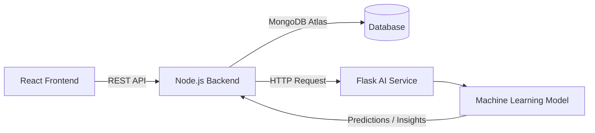

# 💰 MERN Expens AI Tracker

## 🧠 Overview

**MERN Expens AI Tracker** is a next-generation, full-stack personal finance platform enhanced with **Artificial Intelligence**. Built with the **MERN stack (MongoDB, Express.js, React, Node.js)** and a **Flask-based AI microservice**, it enables users to track, analyze, and predict expenses with intelligent insights and data-driven recommendations.

> Empower your financial decisions with predictive analytics and smart insights.

---

## 🚀 Key Features

### 💡 AI-Powered Intelligence

* **Expense Forecasting:** Predict future spending based on history and patterns.
* **Smart Recommendations:** Suggest saving targets and budget adjustments.
* **Anomaly Detection:** Identify unusual transactions or overspending.
* **Category Prediction:** Automatically classify transactions using ML models.

### 💸 Expense & Income Management

* Add, edit, delete, and categorize transactions.
* Emoji-based category visualization.
* Monthly and yearly summaries.
* Excel/CSV data export.

### 📊 Visualization & Analytics

* Recharts-powered graphs (pie, line, bar).
* Expense vs Income balance overview.
* Custom date range filters.
* Real-time dashboard updates.

### 🔐 Authentication & Security

* JWT-based authentication.
* Bcrypt password hashing.
* Secure API routes and CORS protection.
* Profile management and image upload.

### 💻 Cross-Platform & Responsive

* React + Tailwind modern UI.
* Optimized for mobile, tablet, and desktop.
* Toast notifications and smooth animations.

---

## 🏗️ System Architecture



### Components

* **Frontend (React + Vite):** User interface for managing and visualizing data.
* **Backend (Node.js + Express):** Core API handling authentication, transactions, and communication with AI Service.
* **AI Service (Python + Flask):** Hosts trained ML model (`expenses_model.py`) for expense prediction and categorization.

---

## ⚙️ Tech Stack

| Layer          | Technologies                                       |
| -------------- | -------------------------------------------------- |
| **Frontend**   | React 19, Vite, Tailwind CSS, Recharts, Axios      |
| **Backend**    | Node.js, Express 5, MongoDB, Mongoose, JWT, Bcrypt |
| **AI Service** | Python, Flask, Scikit-learn, Pandas, NumPy         |
| **Tools**      | ESLint, Prettier, Nodemon, Concurrently            |

---

## 📁 Directory Structure

```
Expens-AI-Tracker/
├── Ai Service/
│   ├── Doc/                                 # API usage guides
│   └── Expense_AI/
│       ├── ai.py                            # Main Flask entry
│       ├── app.py                           # Flask app routes
│       ├── expenses_model.py                # Trained ML model loader
│       ├── module.py                        # Data preprocessing helpers
│       ├── sample_data.json                 # Sample dataset
│       └── requirements.txt                 # Python dependencies
│
├── BackEnd/
│   ├── config/                              # MongoDB connection setup
│   ├── controllers/                         # Express controllers
│   ├── middleware/                          # JWT middleware, uploads
│   ├── models/                              # User, Expense, Income models
│   ├── routes/                              # API endpoints
│   ├── server.js                            # Node.js entry
│   └── .env                                 # Backend environment variables
│
├── FrontEnd/
│   ├── src/                                 # React components & pages
│   ├── public/                              # Static files
│   └── vite.config.js                       # Vite configuration
│
├── screenshots/                             # UI previews
└── README.md                                # Project documentation
```

---

## ⚙️ Setup & Installation

### 🧩 1. Clone Repository

```bash
git clone https://github.com/yourusername/Expens-AI-Tracker.git
cd Expens-AI-Tracker
```

### 🧠 2. Setup AI Service (Flask)

```bash
cd "Ai Service/Expense_AI"
python -m venv venv
source venv/bin/activate    # or venv\Scripts\activate (Windows)
pip install -r requirements.txt
python app.py
```

AI service will start at: **[http://localhost:5000](http://localhost:5000)**

### 🧱 3. Setup Backend (Node.js)

```bash
cd BackEnd
npm install
cp .env.example .env
npm run dev
```

Backend runs on: **[http://localhost:8000](http://localhost:8000)**

### 💻 4. Setup Frontend (React)

```bash
cd FrontEnd
npm install
npm run dev
```

Frontend runs on: **[http://localhost:5173](http://localhost:5173)**

---

## 🔗 API Communication Flow

**Example:** Predict next month’s expenses

1️⃣ **Frontend → Backend**

```javascript
axios.post("/api/v1/ai/predict", { userId: id, data: transactions });
```

2️⃣ **Backend → Flask Service**

```javascript
const response = await axios.post("http://localhost:5001/predict", { data });
```

3️⃣ **Flask → ML Model**

```python
@app.route('/predict', methods=['POST'])
def predict():
    payload = request.get_json()
    prediction = model.predict(payload['data'])
    return jsonify({ 'prediction': prediction.tolist() })
```

4️⃣ **Backend → Frontend** → Display predictions in charts.

---

## 🔒 Environment Variables

### Backend `.env`

```env
PORT=5000
MONGO_URI=mongodb://localhost:27017/expens-ai
JWT_SECRET=super-secure-key
CLIENT_URL=http://localhost:5173
FLASK_AI_URL=http://localhost:5001
```

## 👨‍💻 Author & Maintainer

**Chien Dang Cao**
📧 [caochiendev@gmail.com](mailto:caochiendev@gmail.com)
🐙 [GitHub](https://github.com/dang-chien)
---
**Duong Khac Nguyen Tung**
📧 [...](mailto:...)
🐙 [GitHub](https://github.com/)
---
**Duy Dang Tran**
📧 [...](mailto:...)
🐙 [GitHub](https://github.com/...)
---

## 📄 License

This project is licensed under the **MIT License**.

> Built with ❤️ using MERN & Flask — merging intelligence with finance.
